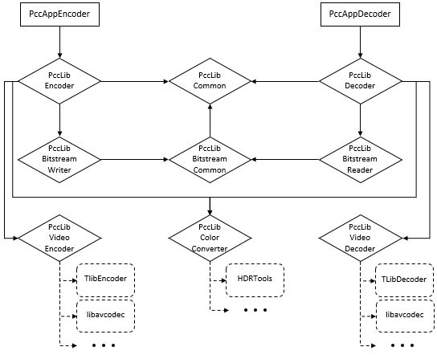

Structure of the test model
===============

This software consists of mutliple executables and libraries. The two main applications are PccAppEncoder and PccAppDecoder, that are the applications used to encode and decode the point clouds. These software are directly linked to the two main libraries: PccLibEncoder and PccLibDecoder that containe the main encoder and decoder processes. The processes and the data structures used both by encoder and decoder are in the PccLibCommon library. The VPCC bitstreams data structures are defined in library: PccLibBitstreamCommon. The encoder and decoder bitstreamer writing and reading processes are stored in to separate libraries: PccLibBitstreamWriter and PccLibBitstreamReader. 

Additional of these two libraries, the virtual wrapper libraries are used to encode video (PccLibVideoEncoder), to decode video (PccLibVideoDecoder) and to perform color conversion of the video streams (PccLibColorConverter). These libraries are wrappers and are used to launch external applications or libraries: HDRTools, HM Encoder/Decoder (TLibEncoder/TLibDecoder). These libraries defined application program interfaces (API) to easyly launch external processesto perform these tasks without change the VPCC source code.  

The below figure is the module dependency draph of the VPCC reference software. 

   

 

      